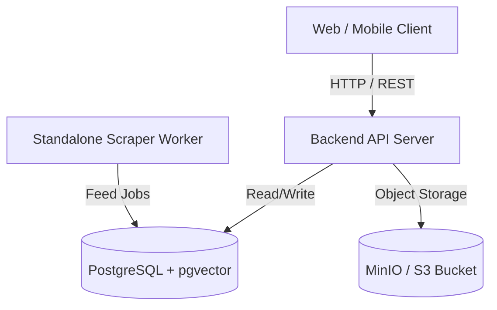
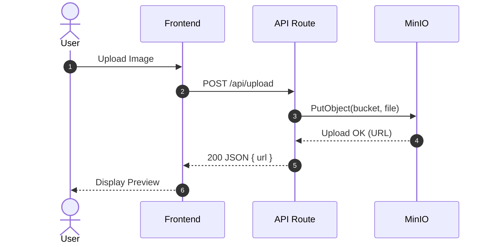

# Technical Documentation Architecture (Doc Architect)

This skill provides templates, diagramming patterns, and formatting standards for engineering documentation that is clear, actionable, and visually engaging.

---

## 1. Professional README Anatomy

Every repository should provide a comprehensive `README.md` containing these sections in order:

1. **Title & High-Level Summary**: 1–2 sentences defining what the system does and who it is for.
2. **Key Capabilities**: Bullet points highlighting core features.
3. **Architecture Overview**: A visual Mermaid diagram depicting data flow and components.
4. **Prerequisites**: Required runtimes (Node version, Dart/Flutter SDK, Docker, PostgreSQL).
5. **Quickstart / Local Setup**: Step-by-step commands:
   ```bash
   git clone <repo>
   cd <repo>
   cp .env.example .env
   npm install
   npm run dev
   ```
6. **Environment Variables**: Table describing keys, default values, and whether they are required.
7. **Available Scripts / Commands**: Table of scripts (`dev`, `build`, `test`, `migrate`).

---

## 2. Mermaid Diagram Standards

Use Mermaid fenced code blocks (`mermaid`) to visualize complex flows:

### Architecture Flow Example:


### Sequence Flow Example:


---

## 3. Architecture Decision Record (ADR) Standard

When introducing significant architectural decisions (e.g. choosing Pinia over Vuex, choosing MinIO over local disk, choosing pgvector over Pinecone), record it under `docs/adr/NNNN-title.md`:

```markdown
# ADR 001: Use MinIO for Object Storage

## Status
Accepted

## Context
We need to store user-uploaded images (thumbnails, certificates, avatars). Storing files on local disk creates issues when containerizing or scaling horizontally. Third-party cloud buckets (AWS S3) incur costs and external latency during local development.

## Decision
We adopt MinIO as an S3-compatible, self-hosted object storage solution. It runs locally via Docker and is fully compatible with the AWS S3 SDK.

## Consequences
- **Positive**: Standard S3 API, zero cloud cost in development, easily swapped to AWS S3 in production.
- **Negative**: Requires running a MinIO service locally or in Docker.
```

---

## 4. Changelog Standard (Keep a Changelog)

Maintain `CHANGELOG.md` grouped by release version and categorized with semantic tags:
- **`Added`** for new features.
- **`Changed`** for changes in existing functionality.
- **`Deprecated`** for soon-to-be removed features.
- **`Removed`** for now removed features.
- **`Fixed`** for any bug fixes.
- **`Security`** in case of vulnerabilities.
