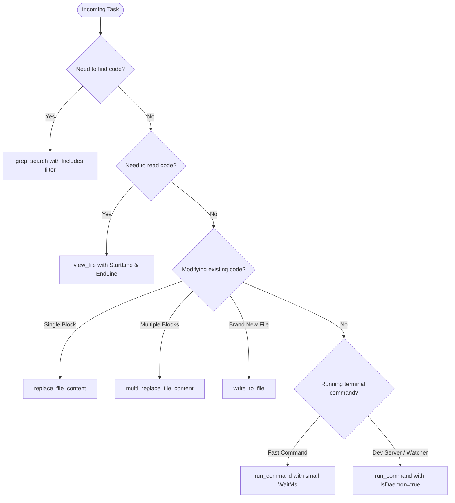

# Efficient Antigravity: Operational Standard

This skill establishes workflows and technical protocols to make pairing with Antigravity as fast, precise, and token-efficient as possible. It eliminates common agent anti-patterns (context bloat, trial-and-error guessing, polling, massive file dumps) and leverages native Antigravity capabilities.

---

## 1. Core Directives for Efficiency

| Pillar | Principle | Anti-Pattern to Avoid | Correct Workflow |
| :--- | :--- | :--- | :--- |
| **Token Economy** | Minimal context footprint | Dumping 800+ lines with `view_file` | Use `grep_search` to find line number $\rightarrow$ view $\pm 30$ lines with `StartLine`/`EndLine` |
| **Surgical Editing** | Targeted diffs | Overwriting entire file via `write_to_file` | Use `replace_file_content` with concise, unique context blocks |
| **Reactive Execution** | Event-driven waiting | Polling `manage_task status` or sleeping in loop | Run commands async or with lean `WaitMsBeforeAsync`; wake up automatically on event |
| **Zero-Guess Diagnostics**| Evidence-first action | Changing random code hoping errors vanish | Read exact error stack trace $\rightarrow$ inspect exact failing line $\rightarrow$ apply minimal fix |
| **Continuous Learning** | Retain project patterns | Repeating the same mistake across sessions | Use `/learn` or update project rules (`GEMINI.md` / `AGENTS.md`) |

---

## 2. Fast Tool Selection Matrix

---

## 3. Power-User Slash Commands

When guiding or collaborating with the user, recommend and utilize Antigravity slash commands to avoid friction:

- **`/goal`**: Recommend when running multi-step or autonomous tasks that should not stop prematurely until the definition of done is met.
- **`/grill-me`**: Recommend before starting complex architectural changes or ambiguous features. Antigravity interviews the user to lock down requirements upfront, avoiding wasted refactors.
- **`/learn`**: Recommend immediately after fixing a tricky bug, configuring an unconventional setup, or learning project conventions. This persists the knowledge into user customizations.
- **`/schedule`**: Recommend for recurring jobs (e.g. background health checks or periodic logs monitoring) or one-shot timer reminders.

---

## 4. Execution Lifecycle

### Phase 1: Pinpoint & Isolate
1. **Never read whole files blindly.** If an error mentions `server/utils/image.ts:42`, view only lines `20` to `65`.
2. Filter terminal output. Do not run commands that emit thousands of lines into the conversation context. Use filters (e.g. piping to `Select-Object -First 30` or checking exit codes).

### Phase 2: Surgical Action
1. Craft the smallest possible patch that solves the problem.
2. Keep leading and trailing indentation exact when using `replace_file_content`.

### Phase 3: Fast Verification
1. Run targeted checks first (e.g., `npx vue-tsc --noEmit` or a single test) rather than a slow full application bundle unless specifically validating production.
2. Verify without polling. The Antigravity runtime alerts the agent when background tasks terminate.

---

## 5. Detailed Reference Sub-documents

For specialized guidelines and templates, refer to:
- [Token & Context Optimization Guide](references/token-optimization.md) - Deep dive into keeping context windows lean.
- [Prompting & User Collaboration Guide](references/prompting-guide.md) - How users can instruct Antigravity for 10x velocity.
- [Quick Diagnostics & Build Runbook](references/quick-diagnostics.md) - Universal fast troubleshooting patterns across tech stacks (Flutter/Dart, Android, Node/TS, Vue/Nuxt, React/Next, Python, Go, Rust).
- [Global Setup Guide](references/global-setup.md) - How to install this skill globally across all repositories.
