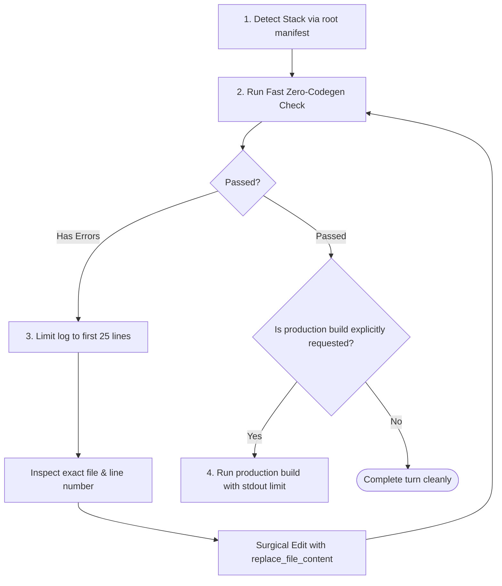

# Universal Quick Diagnostics & Fast Verification Runbook

Different projects use different technology stacks (Flutter, Android, Node/TypeScript, Vue/Nuxt, React/Next, Python, Go, Rust). Running full production builds (`npm run build`, `flutter build apk`, `./gradlew assembleRelease`, `cargo build --release`) to debug code is a major anti-pattern—it wastes minutes and floods the context window with logs.

This runbook provides a **universal stack-detection protocol** and a **fast static diagnostic matrix** that adapts automatically to whatever project is open.

---

## 1. Stack Auto-Detection Protocol

Before executing verification commands, Antigravity identifies the project stack by checking root manifests:

| Manifest File | Detected Stack | Primary Toolchain |
| :--- | :--- | :--- |
| `pubspec.yaml` | Flutter / Dart | `flutter`, `dart` |
| `build.gradle` / `settings.gradle` | Android / JVM | `./gradlew`, `android` CLI |
| `package.json` (`nuxt` in deps) | Nuxt (Vue) | `nuxi`, `vue-tsc`, `npm` |
| `package.json` (`next` in deps) | Next.js (React) | `next`, `tsc`, `npm` |
| `package.json` (vanilla TS / Worker) | Node.js / TypeScript | `tsc`, `tsx`, `tsup` |
| `pyproject.toml` / `requirements.txt` | Python | `python`, `mypy`, `pytest` |
| `go.mod` | Go | `go vet`, `go test` |
| `Cargo.toml` | Rust | `cargo check` |

---

## 2. Universal Rule: "Static Analysis First, Full Build Last"

> [!IMPORTANT]
> **Zero-Codegen Checks Take 1–3 Seconds; Full Production Builds Take 1–5 Minutes.**
> Never trigger a full bundle or package build when checking if imports, types, or syntax are valid.

### Cross-Stack Diagnostic Command Matrix

| Stack | Fast Diagnostic (Seconds) | What to AVOID during Debugging |
| :--- | :--- | :--- |
| **Nuxt 4 / Vue 3** | `npx vue-tsc --noEmit` or `npx nuxi typecheck` | Running `npm run build` repeatedly |
| **Next.js / React** | `npx tsc --noEmit` | Running `npm run build` for simple logic fixes |
| **TypeScript / Workers** | `npx tsc --noEmit -p tsconfig.json` | Bundling with `tsup` / `webpack` just to check types |
| **Flutter / Dart** | `flutter analyze` or `dart analyze` | Running `flutter build apk` or `flutter run` to check errors |
| **Android (Kotlin/Java)** | `./gradlew compileDebugSources` or `lint` | Running `./gradlew assembleRelease` |
| **Python** | `mypy .` or `ruff check .` | Running full end-to-end regression suites |
| **Go** | `go vet ./...` | Running cross-compilation release builds |
| **Rust** | `cargo check` *(checks syntax/types without LLVM codegen)* | Running `cargo build --release` |

---

## 3. Universal 4-Step Diagnostic Algorithm



---

## 4. Stack-Specific Common Traps & Quick Fixes

### A. Web / SSR Frameworks (Nuxt, Next.js, SvelteKit)
- **Error: `window is not defined` / `document is not defined`**:
  - *Cause*: Code executed during Server-Side Rendering (SSR) attempted to access browser DOM APIs.
  - *Fix*: Guard with `import.meta.client` (Nuxt) or `typeof window !== 'undefined'` (Next.js) or move logic into `onMounted()` / `useEffect()`.
- **Error: `EADDRINUSE: address already in use :::3000`**:
  - *Fix*: Terminate orphaned node process:
    ```powershell
    Get-NetTCPConnection -LocalPort 3000 -ErrorAction SilentlyContinue | Select-Object OwningProcess -Unique
    Stop-Process -Id <PID> -Force
    ```

### B. Mobile & Desktop (Flutter, Dart, Android)
- **Error: Type or Null Safety Mismatch**:
  - *Fix*: Run `dart analyze` to pinpoint the exact line, never wait for compilation.
- **Error: Gradle / Native Dependency Conflict**:
  - *Fix*: In Flutter, inspect `pubspec.yaml` versions or run `flutter pub get` before touching native files.

### C. Backend & Workers (Node, Microservices, Python)
- **Error: Unhandled Promise Rejection / DB Connection Timeout**:
  - *Fix*: Verify `.env` variable keys match between development and production configs before modifying database pool configurations.
- **Error: ESM vs CommonJS Mismatch**:
  - *Fix*: Check `"type": "module"` in `package.json` when using `import`/`export` vs `require()`.

---

## 5. Output Limiting Rules

Regardless of the stack, **never let terminal output dump more than 30–50 lines** into the agent's context.

### PowerShell Output Limiting Syntax:
```powershell
# Capture first 25 lines (great for typecheckers and linters):
<command> | Select-Object -First 25

# Capture last 30 lines (great for build failures where error is at the end):
<command> 2>&1 | Select-Object -Last 30
```
