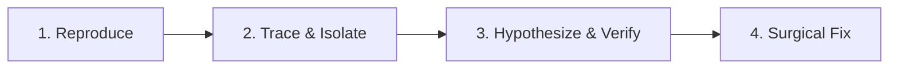

# Systematic Root Cause Analysis (RCA) & Debugging

This skill defines the technical protocol for troubleshooting and resolving defects in any software system. It eradicates guesswork, trial-and-error edits, and superficial symptom patching.

---

## The Golden Rule of Debugging

> [!CAUTION]
> **Never modify production or application code until you can explain the exact mechanism of failure.**
> If you do not understand why it broke, you cannot be certain your change actually fixed it.

---

## 1. The 4-Phase RCA Protocol



### Phase 1: Deterministic Reproduction
1. Establish the exact sequence of steps, inputs, and environment configurations required to trigger the defect.
2. Confirm if the bug is 100% reproducible or intermittent (race condition, network timeout, memory leak).
3. Construct a **Minimal, Complete, and Verifiable Example (MCVE)** or an isolated test case.

### Phase 2: Trace & Isolate (Zero Guessing)
1. Read the stack trace from the **innermost/failing frame** up to user code.
2. Inspect the exact failing line and the variables at that specific timestamp.
3. Classify the failure category:
   - **Type / Null Pointer**: Expected an object or array, received `null`, `undefined`, or empty string.
   - **State Desync**: Cache stale, race condition, or async callback executing after unmount.
   - **Constraint Violation**: Database schema constraint, foreign key, or invalid schema validation.
   - **Environment Drift**: Missing environment variable, different runtime version (Node, Dart, Python).

### Phase 3: The 5-Whys Diagnostic Method
Drill down past the surface symptom to find the systemic flaw:
- *Why did the API return 500?* -> Because `thumbnailUrl` was undefined.
- *Why was `thumbnailUrl` undefined?* -> Because the image upload returned null.
- *Why did upload return null?* -> Because the MinIO bucket rejected the file size.
- *Why did MinIO reject it?* -> Because client-side form validation did not enforce the 2MB limit before upload.
- **Root Cause**: Missing client-side size validation and missing backend fallback handling for failed uploads.

### Phase 4: Surgical Resolution & Verification
1. Apply the fix at the root cause level (not merely silencing the symptom with a loose `try/catch` or `|| ''`).
2. Run the reproduction test to verify the failure is resolved.
3. Verify adjacent features to guarantee zero regressions.

---

## 2. Post-Mortem Incident Template

When documenting a critical or non-obvious bug resolution, capture:

```markdown
### Incident / Bug Post-Mortem

- **Symptom**: What was observed (error message, crash, wrong output).
- **Trigger**: The specific user input or environment state that triggered it.
- **Root Cause**: The underlying flaw in logic, state, or contract.
- **Resolution**: Summary of code changes applied.
- **Prevention**: What test or validation rule was added to prevent recurrence.
```
