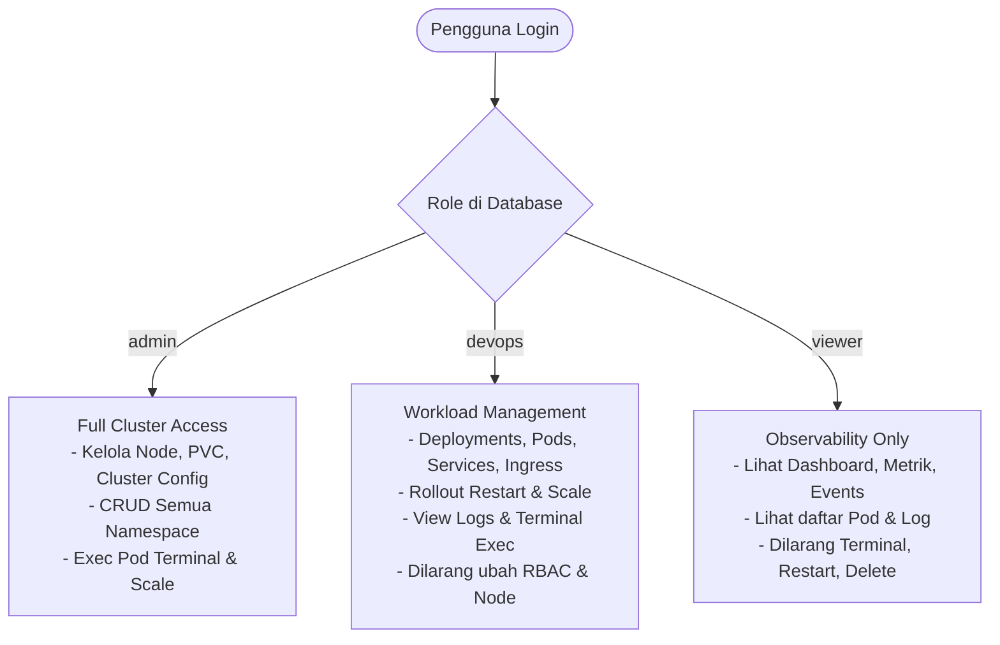

# 📘 Panduan & Rencana Implementasi User Management (CRUD & RBAC)
**Project: KubeNexus — Kubernetes Enterprise Orchestrator**

Dokumen ini berisi arsitektur, spesifikasi teknis, dan langkah-langkah implementasi lengkap untuk fitur **User Management & CRUD** (Backend Go + Frontend Vue 3 PrimeVue) agar bisa dilanjutkan kapan saja.

---

## 📌 1. Ringkasan Kondisi Saat Ini vs Target

| Aspek | Kondisi Saat Ini | Target Implementasi |
| :--- | :--- | :--- |
| **Backend API** | Sudah ada endpoint dasar `/api/v1/users` di [`be/internal/module/user/`](file:///d:/Project/dashboard-kubernetes/be/internal/module/user), tetapi belum ada kolom `role` di database dan `CreateUser` belum menangani inisialisasi password. | • Tambahkan kolom `role` (`admin`, `devops`, `viewer`) via migrasi database.<br>• Dukung set password saat Create User.<br>• Tambahkan endpoint `POST /api/v1/users/:id/reset-password`.<br>• Pasang middleware proteksi hanya `admin` yang bisa mengelola user. |
| **Frontend UI** | Halaman [`fe/src/pages/Users.vue`](file:///d:/Project/dashboard-kubernetes/fe/src/pages/Users.vue) masih berisi 2 baris data dummy statis tanpa aksi apapun. | • Halaman User Management interaktif (DataTable PrimeVue).<br>• Fitur Search, Filter Role & Status.<br>• Dialog **Add User** & **Edit User**.<br>• Dialog **Reset Password**.<br>• Dialog **Delete User** (Soft-delete & Hard-delete). |
| **Integrasi K8s** | Semua user yang login memiliki akses penuh ke cluster. | • Mapping Role: Admin (Full Cluster), DevOps (Deploy/Scale/Exec), Viewer (Read-only observability). |

---

## 🛠️ 2. Backend Implementation (`be/`)

### A. Database Migration: Tambah Kolom `role`
Buat file migrasi baru `migrations/000004_add_user_role.up.sql`:
```sql
ALTER TABLE users ADD COLUMN IF NOT EXISTS role VARCHAR(50) NOT NULL DEFAULT 'viewer';
CREATE INDEX IF NOT EXISTS idx_users_role ON users(role);
```
Down migration `migrations/000004_add_user_role.down.sql`:
```sql
DROP INDEX IF EXISTS idx_users_role;
ALTER TABLE users DROP COLUMN IF EXISTS role;
```

### B. Update Model & DTO ([`be/internal/module/user/user.go`](file:///d:/Project/dashboard-kubernetes/be/internal/module/user/user.go))
Perbarui struct `User`, `CreateUserRequest`, dan `UserResponse`:
```go
type User struct {
    ID        string         `json:"id" db:"id"`
    Name      string         `json:"name" db:"name"`
    Email     string         `json:"email" db:"email"`
    Phone     sql.NullString `json:"phone" db:"phone"`
    Password  string         `json:"-" db:"password"`
    Role      string         `json:"role" db:"role"`         // "admin" | "devops" | "viewer"
    IsActive  bool           `json:"is_active" db:"is_active"`
    CreatedAt time.Time      `json:"created_at" db:"created_at"`
    UpdatedAt time.Time      `json:"updated_at" db:"updated_at"`
}

type CreateUserRequest struct {
    Name     string `json:"name" validate:"required,min=3,max=100"`
    Email    string `json:"email" validate:"required,email"`
    Password string `json:"password" validate:"required,min=6"`
    Role     string `json:"role" validate:"required,oneof=admin devops viewer"`
    Phone    string `json:"phone" validate:"omitempty,min=10,max=15"`
}

type UpdateUserRequest struct {
    Name     string `json:"name" validate:"omitempty,min=3,max=100"`
    Role     string `json:"role" validate:"omitempty,oneof=admin devops viewer"`
    Phone    string `json:"phone" validate:"omitempty,min=10,max=15"`
    IsActive *bool  `json:"is_active"`
}

type ResetPasswordRequest struct {
    NewPassword string `json:"new_password" validate:"required,min=6"`
}

type UserResponse struct {
    ID        string    `json:"id"`
    Name      string    `json:"name"`
    Email     string    `json:"email"`
    Role      string    `json:"role"`
    Phone     string    `json:"phone"`
    IsActive  bool      `json:"is_active"`
    CreatedAt time.Time `json:"created_at"`
    UpdatedAt time.Time `json:"updated_at"`
}
```

### C. Update Repository & Service
1. **Hashing Password**: Saat `service.Create(&req)`, lakukan `bcrypt.GenerateFromPassword([]byte(req.Password), bcrypt.DefaultCost)`.
2. **Reset Password**: Tambahkan method `ResetPassword(id string, newPassword string) error`.

### D. Route Registration ([`be/internal/module/router.go`](file:///d:/Project/dashboard-kubernetes/be/internal/module/router.go))
Pastikan route users diproteksi oleh `AuthMiddleware`:
```go
users := api.Group("/users")
users.Use(authMiddleware.AuthMiddleware(r.JWTService))

users.Get("/", handler.GetUsers())
users.Get("/:id", handler.GetUser())
users.Post("/", handler.CreateUser())
users.Put("/:id", handler.UpdateUser())
users.Delete("/:id", handler.DeleteUser())
users.Post("/:id/reset-password", handler.ResetPassword())
users.Delete("/admin/:id", handler.HardDeleteUser())
```

---

## 🎨 3. Frontend Implementation (`fe/`)

### A. API Layer: Buat [`fe/src/api/user.ts`](file:///d:/Project/dashboard-kubernetes/fe/src/api/user.ts)
```typescript
import { apiClient } from './client'
import type { User, CreateUserPayload, UpdateUserPayload } from '@/types'

export const userApi = {
  getUsers: async (): Promise<User[]> => {
    const res = await apiClient.get<{ data: User[] }>('/users')
    return res.data.data ?? []
  },

  getUser: async (id: string): Promise<User> => {
    const res = await apiClient.get<{ data: User }>(`/users/${id}`)
    return res.data.data
  },

  createUser: async (payload: CreateUserPayload): Promise<User> => {
    const res = await apiClient.post<{ data: User }>('/users', payload)
    return res.data.data
  },

  updateUser: async (id: string, payload: UpdateUserPayload): Promise<User> => {
    const res = await apiClient.put<{ data: User }>(`/users/${id}`, payload)
    return res.data.data
  },

  deleteUser: async (id: string): Promise<void> => {
    await apiClient.delete(`/users/${id}`)
  },

  resetPassword: async (id: string, newPassword: string): Promise<void> => {
    await apiClient.post(`/users/${id}/reset-password`, { new_password: newPassword })
  },
}
```

### B. Pinia Store: Buat [`fe/src/stores/user.ts`](file:///d:/Project/dashboard-kubernetes/fe/src/stores/user.ts)
Mengelola state:
- `users`: Daftar semua pengguna.
- `isLoading`: Indikator loading saat fetch/submit.
- `searchQuery`: Filter pencarian nama/email secara realtime.
- `selectedRoleFilter`: Filter berdasarkan role (`all`, `admin`, `devops`, `viewer`).
- `filteredUsers`: Computed property hasil filter.

### C. Komponen UI Modal:
1. **`UserFormDialog.vue`**:
   - Modal form untuk Create & Edit User.
   - Field: Name, Email, Password (hanya saat create), Role (Dropdown PrimeVue: `admin`, `devops`, `viewer`), Phone, Status Toggle (Active/Inactive).
2. **`ResetPasswordDialog.vue`**:
   - Modal ganti password dengan konfirmasi password baru.
3. **`DeleteUserDialog.vue`**:
   - Konfirmasi sebelum soft delete atau hard delete dengan warning banner.

### D. Halaman Utama [`fe/src/pages/Users.vue`](file:///d:/Project/dashboard-kubernetes/fe/src/pages/Users.vue)
- **Top Stats Cards**:
  - Total Users
  - Active Users
  - Role Breakdown (Admin / DevOps / Viewer)
- **Toolbar**:
  - InputText Search
  - Dropdown Filter Role
  - Tombol "+ Add User" (warna hijau/emerald sesuai tema KubeNexus)
- **PrimeVue DataTable**:
  - Kolom Name & Email (dengan avatar inisial)
  - Kolom Role (Badge dengan warna khusus: Purple untuk Admin, Sky untuk DevOps, Slate untuk Viewer)
  - Kolom Status (Badge hijau untuk Active, abu-abu untuk Inactive)
  - Kolom Created Date (Formatted)
  - Kolom Action (Tombol Edit, Key icon untuk Reset Password, Trash icon untuk Delete)

---

## 🔐 4. Kubernetes Access & Role Mapping (Roadmap Lanjutan)

Ketika User Management sudah berjalan, hak akses ke resource Kubernetes dapat dipetakan secara otomatis:



---

## 🚀 5. Checklist Eksekusi Kapanpun Anda Siap

- [ ] **Step 1**: Jalankan migrasi `000004_add_user_role.up.sql` pada PostgreSQL.
- [ ] **Step 2**: Tambahkan field `Role` & `Password` di backend service/repo `usermodule`.
- [ ] **Step 3**: Buat file `fe/src/api/user.ts` dan `fe/src/stores/user.ts`.
- [ ] **Step 4**: Buat komponen dialog `UserFormDialog.vue` dan ganti dummy data di `fe/src/pages/Users.vue`.
- [ ] **Step 5**: Test login menggunakan user baru yang dibuat melalui dashboard.

---
*File ini tersimpan di root project sebagai acuan referensi kelanjutan fitur User Management.*
